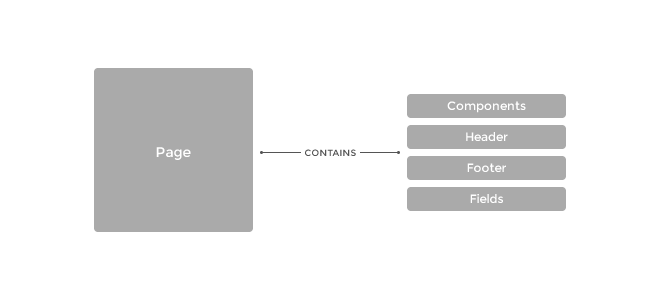

# Documentation #
Welcome to Tucan, a content management system developed for front-end developers. With Tucan CMS you can take control of all aspects of the development and maintenance of a site without a bloated backend whilst keeping the freedom and workflow you already employ.

<!-- MarkdownTOC -->

<!-- /MarkdownTOC -->

### Introduction ###

#### Why? ####
Why did I develop Tucan? After using a number of popular content management systems for my own projects as well as being part of my toolkit for clients, I found that I couldn't achieve exactly the product I wanted to with what I had. Since working for a large car manufacturer as a front-end developer I finally found a workflow that worked for me, lighting the spark to the beginnings of Tucan and developing a system that not only created a great flow between designer and front-end but also gave power back to the other members of a web development team (namely Agile).

#### What can it do for me? ####
Tucan gives you (whatever your expertise are in) the ability to develop a great website rather than work around an OK content management system. Lets talk about the old way of web development; your have a design from the client, it is then created in the front end and all the data is put together in the backend, often orchestrated around a Wordpress or other popular open source/proprietary CMS installation. Users, plugins, libraries and bespoke themes are then developed around this codebase and published to a development environment for testing or pushed straight to live. 

With Tucan, we remove a lot of these steps and instead let you and your team (or just you as a developer) focus on building a brilliant product without a heavy lifting, keeping the workflow you're use to and love. Now, the front end is created from the designs the same way but with the languages you know, without extra knowledge of a certain codebase; cut your templates up into *components* and write your CSS and JS are part of those components. Your components are then available in the site where they can be managed in the backend, setting fields, types and validation. 

Pages are constructued by components containing data inputted by your client or author and best of all, your components are re-usable, they can be duplicated and modified for a specific use or migrated to other projects, freeing up your time to get more done. 

### Structure ###

#### Folder Structure ####

Tucan has been structure to have only one "template" on the front end, but, with the use of `fields` and `variables` the developer can enable other theme options such as setting `dark` themes on certain pages which applies to elements on a component or page - changing the styling. Within the folder structure, all back and front end is sepeated like so:

*For all custom classes and functions used in the site*
<pre>
/app/class/
</pre>

*For all front end resources (layouts, components, JS, HTML, CSS etc.)*
<pre>
/app/resources/frontend/
</pre>

*Ideally this never changes but is similar structure to frontend*
<pre>
/app/resources/backend/ 
</pre>

#### Templating ####

All layouts and components are written in plain HTML but rendered in [Twig](http://twig.sensiolabs.org), this is to allow the developer to add custom variables and content within the component. When saving a new component, please ensure that the file extension is `.twig` and not `.html`. 

#### Database ####

The database inside of Tucan is flat-file, so does not require any SQL connections or maintenance, this also allows for great portability and over all site speed. The decision to go flat-file was down to the fact of not needing the majority of functionality that SQL offers and the site performance was a big consideration throughout development.

### Components ###

Components, comprised of a section of HTML (rendered using the [Twig](http://twig.sensiolabs.org) templating engine) as well as CSS and JS can be used throughout a site within pages containing information (strings, integers, arrays and booleans) which are manageable through the backend. This methodology follows the DRY (Don't repeat yourself) principle and makes it easier to modify and update one section of the site in a single place. An example of a component (in this example as text block called TextBlock) looks like this: 

*textblock.twig*

<pre>
&lt;div class=&quot;textblock&quot;&gt;
	&lt;h1&gt;{{component.header}}&lt;/h1&gt;
	&lt;p&gt;{{component.subheader}}&lt;/p&gt;
	&lt;img src=&quot;{{component.image}}&quot; alt=&quot;{{component.alt}}&quot;/&gt;
	&lt;a href=&quot;{{component.url}}&quot;&gt;{{component.link}}&lt;/a&gt;
&lt;/div&gt;
</pre>

*textblock.css*
<pre>
.textblock {
	font-family: 'Helvetica', sans-serif;
	background: #eee;
	border: 1px solid #999;
	padding: 10px;
	margin: 0;
}

.textblock h1 {
	font-weight: 800;
	color: #222;
}

.textblock p {
	margin: 0;
	letter-spacing: 0.3px;
}

</pre>

*textblock.js*
<pre>

var textblock = {

	links:function() {
		$('.textblock a').on('click', function(e) {
			e.preventDefault();
			if($(this).attr('href') == "http://www.google.com")) {
				alert('I\'m not going to open Google!');
			} else {
				window.href = $(this).attr('href');
			}
		});
	}
};

textblock.links();

</pre> 

This is a really basic example of a component, as you can see from the twig file, all variables are prefixed with `component` - these variables are defined within the backend as custom fields, each page component has custom variable content but can be duplicated over multiple pages. If you want the majority of content the same over multiple pages, instead of duplicating content, you can set a global variable (available in the `Variables` page of the backend) to avoid content duplication. Lets say that we we're going to change all of the fields apart from the header in this variable, we would create a new global variable called `blocktitle-header` and change our code to look like the following:

*textblock.twig*

<pre>
&lt;div class=&quot;textblock&quot;&gt;
	&lt;h1&gt;{{global.blocktitle-header}}&lt;/h1&gt;
	&lt;p&gt;{{component.subheader}}&lt;/p&gt;
	&lt;img src=&quot;{{component.image}}&quot; alt=&quot;{{component.alt}}&quot;/&gt;
	&lt;a href=&quot;{{component.url}}&quot;&gt;{{component.link}}&lt;/a&gt;
&lt;/div&gt;
</pre>

Once the code has been created and set up, the backend developer can create the fields to be used throughout the site, the `Components`page lets the developer set a number of variables such a field type and length, this is especially useful if your client doesn't like to conform to specific text lengths and ends up usually creating a frankenstein of the original design (we've all been there). 

### Pages ###

#### Roles ###

|      Role      |               Summary             |                    Page Rights                |
|:--------------:|:---------------------------------:|:---------------------------------------------:|
| Administrator  | Full Rights                       | Pages, Variables, Components, Users, Settings |
| Author*        | Edits page content                | Pages                                         | 
| Developer      | Manages components and content    | Pages, Variables, Components                  |
| Client         | Edits page content                | Pages                                         |  
| User           | For registered login              | No backend access                             |

*Although an author and client share the same rights, you may have an author in-house whilst never giving the client access to edit their own pages, in this case it makes sense to have an author role and give the client a user role.
